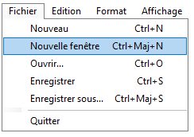

# TextEditor

- [TextEditor](#texteditor)
  - [Présentation](#présentation)
  - [Interface](#interface)
  - [Fonctions](#fonctions)
    - [Menu de fichier](#menu-de-fichier)
      - [Nouveau](#nouveau)
      - [Nouvelle fenêtre](#nouvelle-fenêtre)
      - [Ouvrir](#ouvrir)
      - [Enregistrer et Enregistrer sous](#enregistrer-et-enregistrer-sous)
      - [Quitter](#quitter)
    - [Menu d'édition](#menu-dédition)
      - [Annuler](#annuler)
      - [Couper](#couper)
      - [Copier](#copier)
      - [Coller](#coller)
      - [Coller](#coller-1)
      - [Supprimer](#supprimer)
      - [Sélectionner tout](#sélectionner-tout)
      - [Heure/Date](#heuredate)
    - [Menu de format](#menu-de-format)
      - [Retour automatique à la ligne](#retour-automatique-à-la-ligne)
      - [Police](#police)
    - [Menu d'affichage](#menu-daffichage)
      - [Zoom](#zoom)
        - [Zoom avant](#zoom-avant)
        - [Zoom arrière](#zoom-arrière)
        - [Restaurer le zoom par défaut](#restaurer-le-zoom-par-défaut)
      - [Barre d'état](#barre-détat)
    - [Niveau de zoom](#niveau-de-zoom)


## Présentation

Cette application est une réplique du Bloc-note de Microsoft que l'on retrouve sur tous les systèmes d'exploitations Windows. Le but de ce projet était de manier les applications Forms, de faire de la manipulation de fichiers et d'utiliser les diverses fonctions qui permettent de faire du traitement de texte.

## Interface

Bloc-note de Windows | TextEditor
:-------------------:|:--------:|
||

## Fonctions

### Menu de fichier



#### Nouveau
```
private void msi_newFile_Click(object sender, EventArgs e)
{
    this.file = new TextFile { FileName = "Nouveau fichier", Exists = false, isSaved = true };
    this.updateWindowName(this.file);
    this.rtb_editor.Text = "";
}
```

#### Nouvelle fenêtre
```
private void msi_newWindow_Click(object sender, EventArgs e)
{
    TextEditor newWindow = new TextEditor();
    newWindow.Show();
}
```

#### Ouvrir
```
private void msi_openFile_Click(object sender, EventArgs e)
{
    OpenFileDialog open = new OpenFileDialog();
    open.Filter = "txt files (*.txt)|*.txt|All files (*.*)|*.*";
    if (open.ShowDialog() == DialogResult.OK)
    {
        using (StreamReader reader = new StreamReader(open.FileName))
        {
            this.rtb_editor.Text = reader.ReadToEnd();
            this.lbl_encoding.Text = reader.CurrentEncoding.BodyName.ToUpper();
            reader.Close();
        }
        this.file.FileName = open.FileName;
        this.file.Exists = true;
    }
    this.updateWindowName(this.file);
}
```

#### Enregistrer et Enregistrer sous

Dans les deux cas on utilise la fonction "saveFile". On change seulement le paramètre selon le type d'enregistrement.

```
private void saveFile(bool exists)
{
    if (!exists || this.file.FileName == null)
    {
        SaveFileDialog save = new SaveFileDialog();
        save.Filter = "txt files (*.txt)|*.txt|All files (*.*)|*.*";
        if (save.ShowDialog() == DialogResult.OK)
        {
            StreamWriter writer = new StreamWriter(save.FileName);
            writer.WriteLine(this.rtb_editor.Text);
            writer.Close();
            this.file.FileName = save.FileName;
            this.file.isSaved = true;
            this.file.Exists = true;
        }
        this.updateWindowName(this.file);
    }
    else
    {
        StreamWriter writer = new StreamWriter(file.FileName);
        writer.WriteLine(this.rtb_editor.Text);
        writer.Close();
        this.file.isSaved = true;
        this.file.Exists = true;
        this.updateWindowName(this.file);
    }
}
```

#### Quitter
```
private void msi_quitWindow_Click(object sender, EventArgs e)
{
    this.Close();
}
```

---

### Menu d'édition


#### Annuler
```
private void annulerText(object sender, EventArgs e)
{
    this.rtb_editor.Undo();
}
```

#### Couper
```
private void cutText(object sender, EventArgs e)
{
    Clipboard.SetText(this.rtb_editor.SelectedText);
    this.rtb_editor.SelectedText = "";
}
```

#### Copier
```
private void copyText(object sender, EventArgs e)
{
    Clipboard.SetText(this.rtb_editor.SelectedText);
}
```

#### Coller
```
private void pasteText(object sender, EventArgs e)
{
    this.rtb_editor.SelectedText = Clipboard.GetText();
}
```

#### Coller
```
private void pasteText(object sender, EventArgs e)
{
    this.rtb_editor.SelectedText = Clipboard.GetText();
}
```

#### Supprimer
```
private void deleteText(object sender, EventArgs e)
{
    this.rtb_editor.SelectedText = String.Empty;
}
```

#### Sélectionner tout
```
private void msi_selectAll_Click(object sender, EventArgs e)
{
    this.rtb_editor.SelectAll();
}
```

#### Heure/Date
```
private void msi_getDate_Click(object sender, EventArgs e)
{
    this.rtb_editor.SelectedText += DateTime.Now.ToString();
}
```

---

### Menu de format


#### Retour automatique à la ligne
```
private void msi_automaticReturn_Click(object sender, EventArgs e)
{
    if (this.msi_automaticReturn.Checked)
    {
        this.msi_automaticReturn.Checked = false;
        this.rtb_editor.WordWrap = false;
    }
    else
    {
        this.msi_automaticReturn.Checked = true;
        this.rtb_editor.WordWrap = true;
    }
}
```

#### Police
```
private void msi_font_Click(object sender, EventArgs e)
{
    FontDialog fontDialog = new FontDialog();
    fontDialog.Font = this.rtb_editor.Font;
    if (fontDialog.ShowDialog() == DialogResult.OK)
    {
        this.rtb_editor.Font = fontDialog.Font;
    }
}
```

---

### Menu d'affichage


#### Zoom

##### Zoom avant
```
private void msi_zoomFoward_Click(object sender, EventArgs e)
{
    this.rtb_editor.ZoomFactor += this.zoomBearing;
}
```

##### Zoom arrière
```
private void msi_zoomBackward_Click(object sender, EventArgs e)
{
    if (this.rtb_editor.ZoomFactor - this.zoomBearing > 0)
        this.rtb_editor.ZoomFactor -= this.zoomBearing;
}
```

##### Restaurer le zoom par défaut
```
private void msi_zoomDefault_Click(object sender, EventArgs e)
{
    this.rtb_editor.ZoomFactor = 1f;
}
```

#### Barre d'état
```
private void msi_stateBar_Click(object sender, EventArgs e)
{
    if (this.msi_stateBar.Checked)
    {
        this.msi_stateBar.Checked = false;
        this.panel_stateBar.Hide();
        this.rtb_editor.Dock = DockStyle.Fill;
    }
    else
    {
        this.msi_stateBar.Checked = true;
        this.panel_stateBar.Show();
        this.rtb_editor.Dock = DockStyle.None;
    }
}
```

---

### Niveau de zoom
```
private void changeZoom(object sender, EventArgs e)
{
    this.lbl_zoom.Text = String.Format("{0}%", this.rtb_editor.ZoomFactor * 100);
}
```